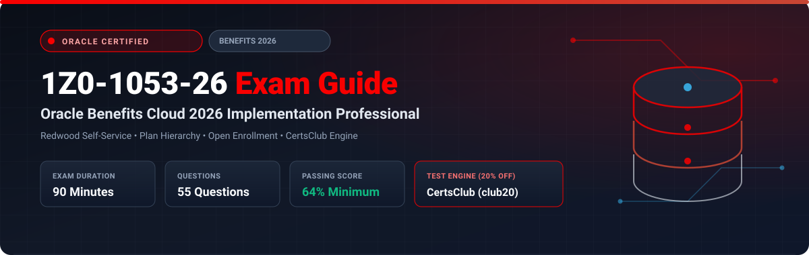

  

# Oracle Benefits Cloud 2026 Implementation Professional (1Z0-1053-26) Exam Study Guide & Practice Test Resource Portal

[-f80000?style=for-the-badge&logo=oracle&logoColor=white)](https://education.oracle.com/)
[-f80000?style=for-the-badge&logo=oracle)](https://education.oracle.com/)

[-28a745?style=for-the-badge&logo=shield)](https://www.certsclub.com/oracle/)

---

## 1. Exam Overview & Candidate Profile

The **Oracle Benefits Cloud 2026 Implementation Professional (1Z0-1053-26)** exam validates that an implementation consultant possesses the modern knowledge needed to configure and administer Oracle Fusion Cloud Benefits with Redwood self-service experiences. The exam covers Program and Plan design, Redwood employee enrollment journeys, life events automation, Flex Credits, rate matrix definitions, and batch evaluation processing.

Passing 1Z0-1053-26 awards the **Oracle Benefits Cloud 2026 Certified Implementation Professional** credential.

### Target Candidate Profile & Career Roles
* **Lead Benefits Implementation Consultants**
* **Total Rewards Solutions Architects**
* **HCM Cloud Systems Engineers**

---

## 2. Key Exam Specifications

| Parameter | Official Specification |
| :--- | :--- |
| **Exam Code** | 1Z0-1053-26 |
| **Exam Title** | Oracle Benefits Cloud 2026 Implementation Professional |
| **Associated Credential** | Oracle Benefits Cloud 2026 Certified Implementation Professional |
| **Duration** | 90 Minutes |
| **Number of Questions** | 55 Questions |
| **Passing Score** | 64% |
| **Question Format** | Multiple Choice (Single and Multiple Select) |
| **Delivery Vendor** | Pearson VUE / Oracle University Online Remote Proctoring |
| **Recommended Practice Test Engine** | **[1Z0-1053-26 Practice Test - CertsClub](https://www.certsclub.com/oracle/)** (Coupon: `club20` for 20% off) |

---

## 3. Official Blueprint & Exam Domain Breakdown

| Domain Code | Domain Title | Weighting | Key Competencies Covered |
| :--- | :--- | :---: | :--- |
| **1.0** | **Plan Hierarchy & Redwood UX** | **25%** | Programs, Plans, Options; Redwood benefits enrollment flow; Mobile responsiveness. |
| **2.0** | **Life Event Processing & Eligibility** | **25%** | Open enrollment and life events; Collisions; Eligibility profiles with derived factors. |
| **3.0** | **Rate Definitions & Flex Credit Pools** | **20%** | Standard/Variable rates; Coverage calculations; Flex credits; Imputed income. |
| **4.0** | **Beneficiaries, Dependents & Court Orders** | **15%** | Dependent designations, Court order mandates (QMCSO), Document certifications. |
| **5.0** | **Scheduled Processes & Payroll Links** | **15%** | Evaluate Life Event Participation, Close Enrollments, Element entry generation. |

---

## 4. Scenario-Based Demo Question & Explanation

### Question 1: Redwood Benefits Self-Service
**Scenario:** An employee undergoes Open Enrollment in the Redwood UI. They make several selections across Medical and Dental, then leave the session without clicking "Submit". 

What happens to their elections?

A) The selections are discarded immediately.  
B) Elections are saved as a draft and can be resumed until the Open Enrollment period closes.  
C) The employee is locked out of benefits.  
D) An error alert is sent to HR.  

**Correct Answer:** **B**

**Detailed Explanation:**
* In Oracle Benefits Redwood self-service, elections are retained as in-progress drafts throughout the active enrollment window, enabling workers to review, modify, and submit their final package prior to the period closing date.

---

## 5. Recommended Preparation Strategy & Practice Testing Engine

1. **Practice Redwood Open Enrollment:** Configure a test Program and execute Open Enrollment cycles from employee and administrator viewpoints.
2. **Practice with Full-Length Mock Exams:** Use **[CertsClub Oracle 1Z0-1053-26 Practice Tests](https://www.certsclub.com/oracle/)**.
   * Up-to-date with 2026 objectives and scenario-based questions.
   * Enter discount coupon code **`club20`** at checkout on [CertsClub](https://www.certsclub.com/oracle/) for an immediate 20% discount.

---

## 6. Official Documentation & References

* [Oracle Fusion Cloud Benefits 2026 Documentation](https://docs.oracle.com/en/cloud/saas/human-resources/benefits/)
* [Oracle University 1Z0-1053-26 Exam Details](https://education.oracle.com/)
* [CertsClub 1Z0-1053-26 Practice Engine](https://www.certsclub.com/oracle/)
